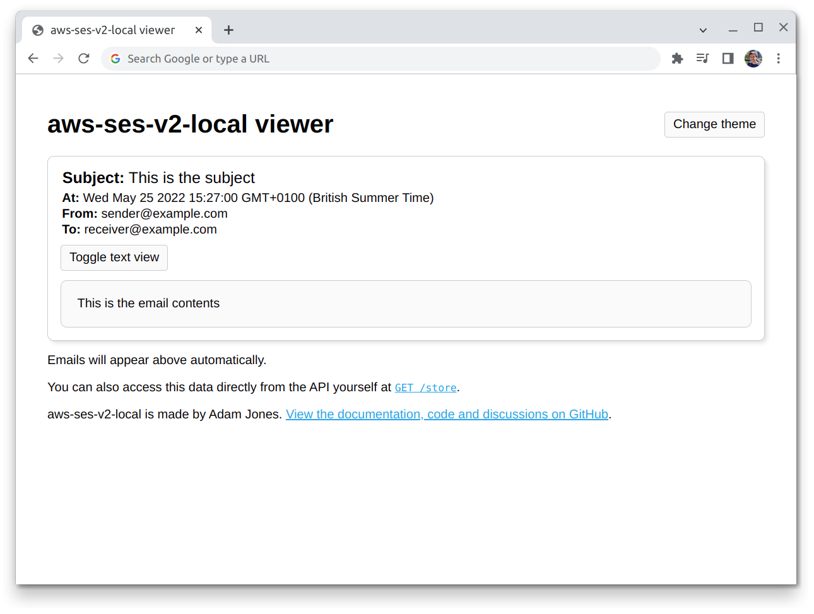

# AWS SES for sending emails with offline support

Sending emails on a schedule with AWS EventBridge, AWS Lambda, AWS SES with offline support

## How it works

[`serverless.yml`](./serverless.yml) defines a `sendEmail` AWS Lambda function that is invoked every minute (using EventBridge under the hood). It also states that when it is invoked it should call the `main` function in [`handler(.js)`](./handler.js). There's also some basic IAM statements that grant the function permission to send emails via SES. The handler itself uses the AWS SES V2 SDK to send a fairly basic email when it is invoked.

To get it working locally, we add the [`serverless-offline`](https://github.com/dherault/serverless-offline) and [`serverless-offline-ses-v2`](https://github.com/domdomegg/serverless-offline-ses-v2) plugins to [`serverless.yml`](./serverless.yml). This allows us to simulate the parts of AWS we need locally. When we call `npm start`, this runs the `start` script in [`package.json`](./package.json) that starts up the plugins. `serverless-offline` automatically sets the [`IS_OFFLINE`](https://github.com/dherault/serverless-offline/#the-processenvis_offline-variable) environment variable so we know to set up the AWS SES V2 SDK to point at `serverless-offline-ses-v2`.

We can see the results of the function locally by opening up the viewer that `aws-ses-v2-local` starts up for us (which is managed by the `serverless-offline-ses-v2` plugin):



## Setup

```
npm install
```

## Running locally

```
npm start
```

Open [localhost:8005](http://localhost:8005) to see the emails being sent.

By default, the function will be invoked every minute. If you want to invoke it manually and have the AWS CLI installed, you can open another terminal and run:

```
aws lambda invoke /dev/null \
  --endpoint-url http://localhost:3002 \
  --function-name aws-node-ses-send-email-and-offline-dev-sendEmail
```

More details on manually invoking Lambda functions locally can be found in [the `serverless-offline` documentation](https://github.com/dherault/serverless-offline/#usage-with-invoke).

## Deploying to AWS

```
serverless deploy
```
